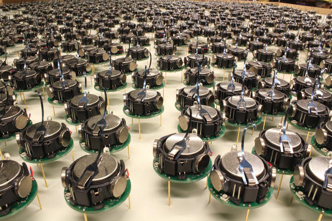
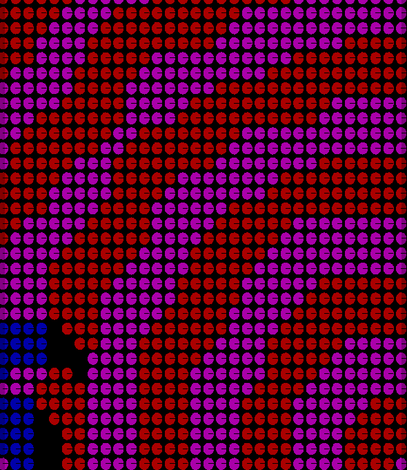
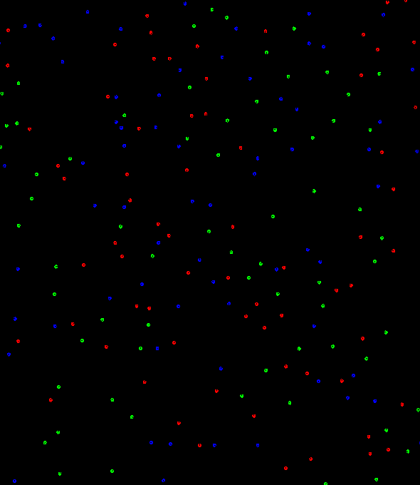
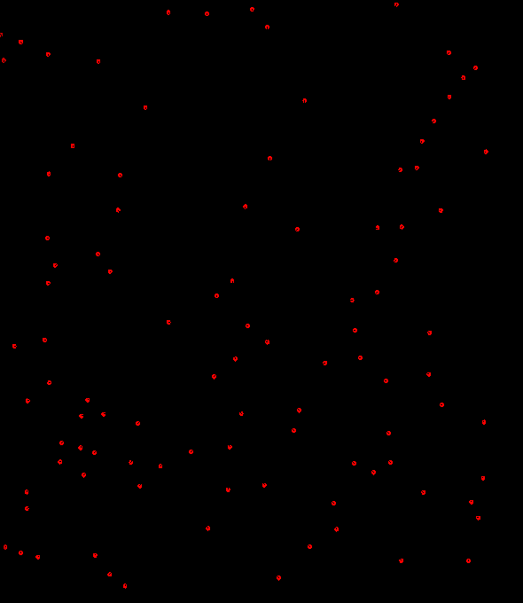
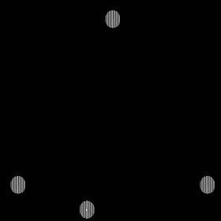
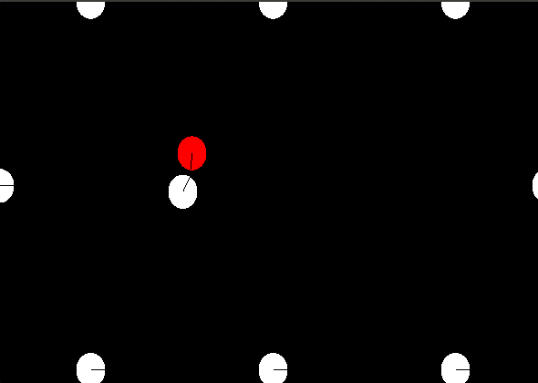
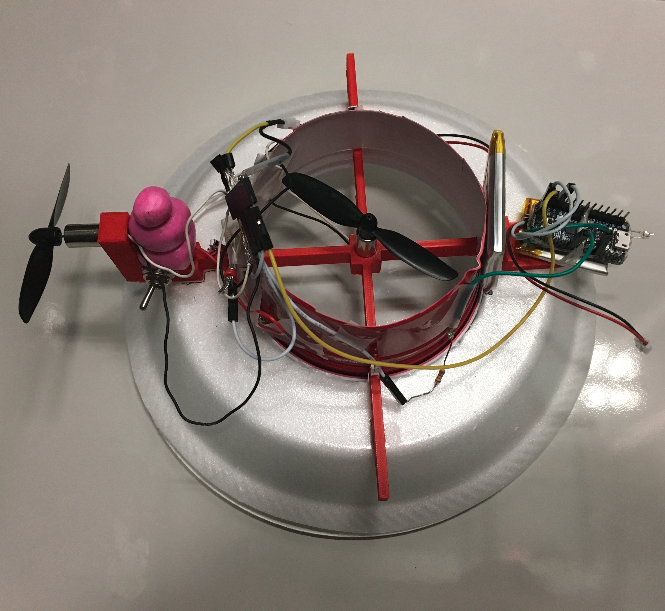
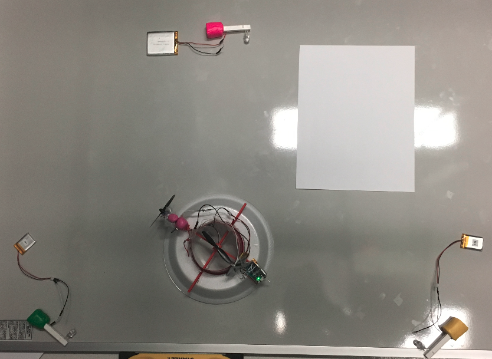
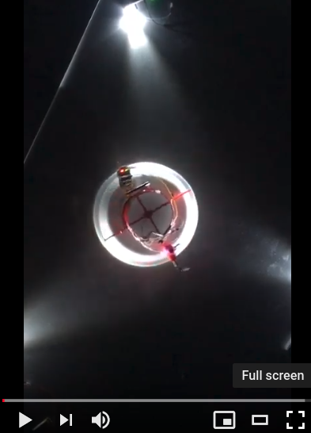

# Swarm Robotics

This research project studies:
* multi-agent distributed algorithms - **subproject I** demonstrates three swarm behaviors: coordination, segregation, and locomotion
* robust localization with cheap sensor on a low cost underactuated system - **subproject II** documents software and hardware implementations

For both subprojects I verify concepts on the kilobot simulation engine. [Kilobot](https://www.kilobotics.com/) is a low cost swarm robot designed by professor Michael Rubenstein. More details can be found [here](https://dash.harvard.edu/bitstream/handle/1/9367001/rubenstein_kilobotlow.pdf?sequence=1).

## Subproject I - Distributed Coordination, Segregation, and Locomotion

### Coordinate system based on Hopcount

In a multi-agent distributed system, it is necessary for robots to communicate their relative position before delivering coordinated behaviors. Hopcount, an approximate representation of how far one robot is from another, is used to triangulate the relative position of a robot within a swarm. In the simulation below, a swarm of static kilobots will first communicate with each other, marked by color changes, before forming the letter "N" of "Northwestern" collectively. More details of the algorithm are presented in this [paper](http://citeseerx.ist.psu.edu/viewdoc/download?doi=10.1.1.7.8705&rep=rep1&type=pdf).

<!--  -->

Fig 1. Kilobots coordinate to display a "N". Color stripes indicate information flow of local relativeness to build a global coordinate system

### Segregation based on Brazil nut effect

Often times it is helpful for a robot swarm to segregate into different functional groups. One distributed way of achieving segregation is through the Brazil nut effect: The largest particles in a bag of variously sized objects usually end up on the surface after shaking the bag. A typical example is a container of mixed nuts, and Brazil nuts which are the largest usually appear on top. In the simulation kilobots of different color have different virtual radii and thus will segregate into different groups through their interaction. More details regarding the algorithm can be found [here](http://naturalrobotics.group.shef.ac.uk/supp/2012-001/)

<!--  -->

Fig 2. Kilobots segregate into color groups based on their virtual radii

### Locomotion based on Reynolds flocking

[Starling flock](https://www.youtube.com/watch?v=V4f_1_r80RY) is one of the most spectacular swarm behaviors found in nature. When one starling changes direction or speed, its neighbors will respond to the change almost simultaneously and thus the change propagates throughout the flock lightning fast regardless of its size. As no single starling dictates the movement of the flock, interesting patterns can emerge from the collective behavior. This simulation tries to replicate this swarm behavior by implementing Reynolds flocking, which is characterized by three rules: keep separation to avoid crowding, maintain alignment with the average heading of local flockmates, and retain cohesion to move towards the center of local flockmates. The algorithm is detailed in this [paper](https://infoscience.epfl.ch/record/169280/files/IROS11_Hauert.pdf).

<!--  -->

Fig 3. Kilobots mimic starling flocking

## Subproject II - Low-cost Hovercraft Sensing and Localization

### Motivation

This work is inspired by [Piccolissimo - the smallest micro-aerial vehicle (Piccoli, et al).](https://www.modlabupenn.org/2016/10/27/piccolissimo/) The steerable MAV hovers with only one actuator while the body spins in the opposite direction to achieve passive stability. We add one light sensor on board, so the sensor records light pulses of surrounding light sources as it spins with the body. Given a triangular set of lights, the MAV can use the light pulses to position itself at the center of the triangle. While this project focuses on localization of a single low cost rotating hovercraft, we aim to build a swarm of such low cost MAV with navigation capability eventually.

### Simulation

I develop distributed algorithms to localize single agent and multi-agent swarm at the center of a light array without central coordination. I use the heuristic that signal pulses coming from the light sensor that rotates at constant velocity should be evenly spaced. If two light intensity peaks are observed within too short an interval, the agent is likely too far away from those light sources and should adjust by moving closer. The zigzag trace in the slow-motion Fig 4 demonstrates these micro adjustments which allows the hovercraft to stay stably at the center. Fig 5 shows an extension of the work on single agent and uses other participating agents as additional light sources to help achieve stable localization at equilibrium.

|||
|----------------------------------------------------------|-----|
|Fig 4. Single agent localization|Fig 5. Multi-agent localization|

### Hardware Implementation

We seek to realize the single agent localization on a custom-made low-cost hovercraft, which consists of a Adafruit Trinket Mini microcontroller, one 3.7V Lithium battery, one light sensor, two propellers, two micro motors, one disposable cup and one foam plate. The build is shown in Fig 6 and the light set up in Fig 7.

|||
|----------------------------------------------------|-------------------------|
|Fig 6. Hovercraft setup|Fig 7. Triangular light setup|

In the slow motion video below, I show the self-rotating hovercraft senses the three light sources by blinking the red LED in those directions (the green LED is for power and always on). The prolonged red LED trace marks the longest interval, indicating the hovercraft is too off center in that direction, and during which the second horizontal propeller will be activated to pull the hovercraft away from that direction, although this function is still under development.

If you have any questions about my work, you can find me at my [portfolio page](https://yanweiw.github.io/). Cover photo credit to [Harvard SEAS](https://www.seas.harvard.edu/news/2014/08/self-organizing-thousand-robot-swarm).
